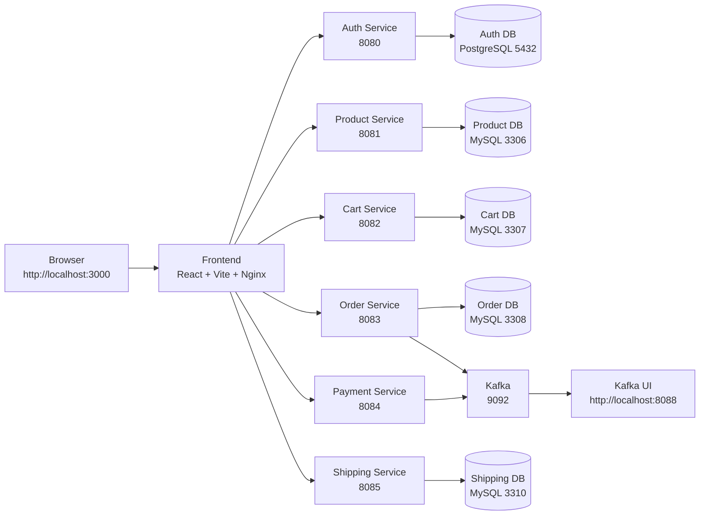

# E-Commerce-Application

Microservices-based e-commerce application with:
- Auth Service (Spring Boot + PostgreSQL)
- Product Service (Spring Boot + MySQL)
- Frontend (React + Vite)
- Nginx reverse proxy for single-entry routing

## Local Architecture

The repository now uses one root Compose file for the full stack. The frontend is served by Nginx on port 3000, while the backend services and data stores run inside the same Docker network.



## Request Routing

Nginx receives all browser requests on port 80 and routes by path:
- `/` -> React static frontend
- `/api/auth/*` -> Auth Service (`:8080`)
- `/api/product/*` -> Product Service (`:8081`) with rewrite from `/api/product/*` to `/api/*`

Public exposure policy:
- Public: only Nginx on port `80`
- Internal-only: Auth Service `8080`, Product Service `8081`, databases `5432` and `3306`
- In cloud firewall/security-group rules, allow inbound `80` (and `443` if TLS), block public inbound to `8080`, `8081`, `5432`, `3306`

Frontend uses relative API URLs:
- `frontend/src/api/authApi.ts` -> `/api/auth`
- `frontend/src/api/productApi.ts` -> `/api/product`

This avoids hardcoding public IPs in frontend code.

## Project Structure

```text
E-Commerce-Application/
	auth-service/
	product-service/
	frontend/
```

## Prerequisites

- Docker + Docker Compose
- Java 17+
- Maven 3.8+
- Node.js 20+
- npm

## Run the Application Locally

### 1. Start the full stack

From the project root, build and start every service with the single Compose file:

```bash
docker compose up -d --build
```

This starts the complete local environment:
- Frontend: http://localhost:3000
- Kafka UI: http://localhost:8088
- Auth service: http://localhost:8080
- Product service: http://localhost:8081
- Cart service: http://localhost:8082
- Order service: http://localhost:8083
- Payment service: http://localhost:8084
- Shipping service: http://localhost:8085
- Kafka broker: localhost:9092
- Zookeeper: localhost:2181

### 2. Verify the stack

```bash
docker compose ps
```

Expected status: all containers should show `Up`.

You can also verify HTTP endpoints with:

```bash
curl -i http://localhost:3000/
curl -i http://localhost:8081/api/products
curl -i http://localhost:8084/health
curl -i http://localhost:8085/health
```

### 3. Optional: run the frontend in development mode

If you want Vite dev mode instead of the Dockerized Nginx frontend:

```bash
cd frontend
npm install
npm run dev
```

Open:
- http://localhost:5173

The Vite proxy in `frontend/vite.config.ts` routes frontend API calls to the backend services.

### 4. Kafka quick check

To confirm Kafka is working from the broker container:

```bash
docker compose exec -T kafka sh -lc 'kafka-topics --bootstrap-server localhost:9092 --list'
```

For a real message round-trip test:

```bash
docker compose exec -T kafka sh -lc 'kafka-topics --bootstrap-server localhost:9092 --create --if-not-exists --topic kafka-proof --partitions 1 --replication-factor 1 >/dev/null 2>&1; echo "proof-message" | kafka-console-producer --bootstrap-server localhost:9092 --topic kafka-proof; timeout 30s kafka-console-consumer --bootstrap-server localhost:9092 --topic kafka-proof --from-beginning --max-messages 1 --timeout-ms 20000'
```

## Key Configuration Files

- `frontend/nginx.conf`
- `docker-compose.yml`
- `frontend/Dockerfile`
- `frontend/src/api/authApi.ts`
- `frontend/src/api/productApi.ts`
- `frontend/vite.config.ts`
- `auth-service/src/main/resources/application.yml`
- `product-service/src/main/resources/application.properties`

## API Examples

Auth:
- `POST /api/auth/register`
- `POST /api/auth/login`

Auth access policy:
- Public endpoints: `/api/auth/login`, `/api/auth/register`
- Other auth endpoints require authentication

Products:
- `GET /api/product/products`
- `GET /api/product/products/filter?categoryId=1&keyword=phone`
- `GET /api/product/categories`

Product access policy:
- Public read endpoints: `GET /api/product/**`
- Protected write endpoints: `POST /api/product/products`, `POST /api/product/categories` (JWT required)

## Troubleshooting

If frontend loads but APIs fail:
- Check Nginx container logs:

```bash
cd frontend
docker compose logs -f
```

- Verify backend ports are listening:
	- Auth: `8080`
	- Product: `8081`

- Confirm backend is bound to all interfaces:
	- Auth: `server.address: 0.0.0.0`
	- Product: `server.address=0.0.0.0`

- CORS origins enabled in backend security:
	- `http://localhost:5173`
	- `http://18.207.151.13`

- If running Nginx in Docker on Linux, `host.docker.internal` is mapped via:
	- `extra_hosts: ["host.docker.internal:host-gateway"]`
