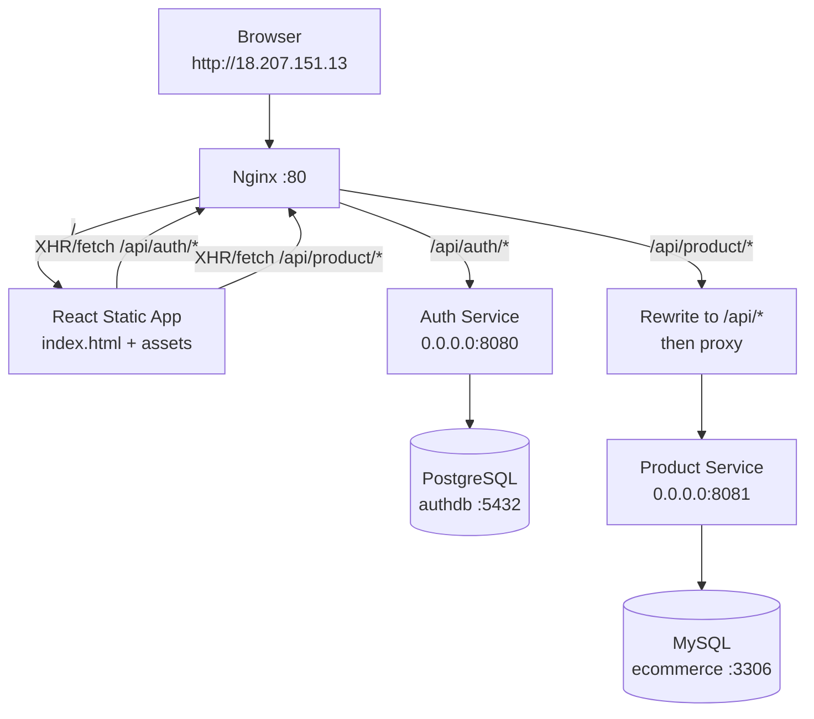

# E-Commerce-Application

Microservices-based e-commerce application with:
- Auth Service (Spring Boot + PostgreSQL)
- Product Service (Spring Boot + MySQL)
- Frontend (React + Vite)
- Nginx reverse proxy for single-entry routing

## Architecture



## Request Routing

Nginx receives all browser requests on port 80 and routes by path:
- `/` -> React static frontend
- `/api/auth/*` -> Auth Service (`:8080`)
- `/api/product/*` -> Product Service (`:8081`) with rewrite from `/api/product/*` to `/api/*`

Public exposure policy:
- Public: only Nginx on port `80`
- Internal-only: Auth Service `8080`, Product Service `8081`, databases `5432` and `3306`
- In cloud firewall/security-group rules, allow inbound `80` (and `443` if TLS), block public inbound to `8080`, `8081`, `5432`, `3306`

Frontend uses relative API URLs:
- `frontend/src/api/authApi.ts` -> `/api/auth`
- `frontend/src/api/productApi.ts` -> `/api/product`

This avoids hardcoding public IPs in frontend code.

## Project Structure

```text
E-Commerce-Application/
	auth-service/
	product-service/
	frontend/
```

## Prerequisites

- Docker + Docker Compose
- Java 17+
- Maven 3.8+
- Node.js 20+
- npm

## Run the Application

### 0. Start Kafka (Optional Messaging Layer)

From the project root:

```bash
docker compose up -d
```

This starts:
- Kafka broker on `localhost:9092`
- Zookeeper on `localhost:2181`
- Kafka UI on `http://localhost:8088`

### 1. Start Databases

Start PostgreSQL for auth:

```bash
cd auth-service
docker compose up -d
```

Start MySQL for products:

```bash
cd product-service
docker compose up -d
```

### 2. Start Backend Services

Start Auth Service on `0.0.0.0:8080`:

```bash
cd auth-service
./mvnw spring-boot:run
```

Start Product Service on `0.0.0.0:8081`:

```bash
cd product-service
./mvnw spring-boot:run
```

If `mvnw` is not available in your environment, use `mvn spring-boot:run`.

### 3. Start Frontend Through Nginx (Recommended)

```bash
cd frontend
docker compose up -d --build
```

Open:
- `http://18.207.151.13`

Nginx config file:
- `frontend/nginx.conf`

### 4. Frontend Dev Mode (Optional)

```bash
cd frontend
npm install
npm run dev
```

Open:
- `http://localhost:5173`

Vite proxy (`frontend/vite.config.ts`) forwards:
- `/api/auth` -> `http://localhost:8080`
- `/api/product` -> `http://localhost:8081` (rewritten to `/api/...`)

## Key Configuration Files

- `frontend/nginx.conf`
- `docker-compose.yml`
- `frontend/docker-compose.yml`
- `frontend/Dockerfile`
- `frontend/src/api/authApi.ts`
- `frontend/src/api/productApi.ts`
- `frontend/vite.config.ts`
- `auth-service/src/main/resources/application.yml`
- `product-service/src/main/resources/application.properties`

## API Examples

Auth:
- `POST /api/auth/register`
- `POST /api/auth/login`

Auth access policy:
- Public endpoints: `/api/auth/login`, `/api/auth/register`
- Other auth endpoints require authentication

Products:
- `GET /api/product/products`
- `GET /api/product/products/filter?categoryId=1&keyword=phone`
- `GET /api/product/categories`

Product access policy:
- Public read endpoints: `GET /api/product/**`
- Protected write endpoints: `POST /api/product/products`, `POST /api/product/categories` (JWT required)

## Troubleshooting

If frontend loads but APIs fail:
- Check Nginx container logs:

```bash
cd frontend
docker compose logs -f
```

- Verify backend ports are listening:
	- Auth: `8080`
	- Product: `8081`

- Confirm backend is bound to all interfaces:
	- Auth: `server.address: 0.0.0.0`
	- Product: `server.address=0.0.0.0`

- CORS origins enabled in backend security:
	- `http://localhost:5173`
	- `http://18.207.151.13`

- If running Nginx in Docker on Linux, `host.docker.internal` is mapped via:
	- `extra_hosts: ["host.docker.internal:host-gateway"]`
